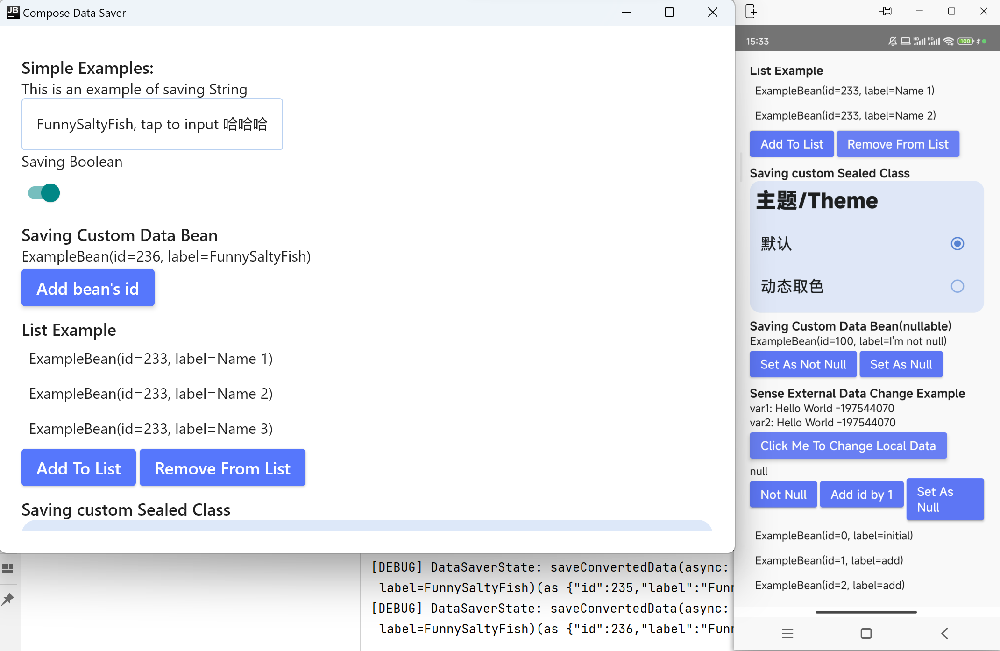

# ComposeDataSaver

| [](https://jitpack.io/#FunnySaltyFish/CMaterialColors) | [](http://www.apache.org/licenses/LICENSE-2.0) |
| ------------------------------------------------------------ | ------------------------------------------------------------ |

| [English Version](README_en.md) |

优雅地在Jetpack Compose中完成数据持久化

```kotlin
var booleanExample by rememberDataSaverState(KEY_BOOLEAN_EXAMPLE, false)
Switch(checked = booleanExample, onCheckedChange = {
	booleanExample = it
})
```


- [x] 简洁：近似原生Compose的写法
- [x] 低耦合：抽象接口，不限制底层保存算法实现
- [x] 轻巧：默认不引入除Compose外任何第三方库
- [x] 强大：支持基本的数据类型和自定义类型、支持List类型





---

## 引入

在`settings.gradle`引入jitpack仓库位置

```bash
dependencyResolutionManagement {
    repositories {
        maven { url "https://jitpack.io" }
    }
}
```

在项目`build.gradle`引入

```bash
dependencies {
        implementation 'com.github.FunnySaltyFish.ComposeDataSaver:data-saver:{tag}'
}
```

## 基本使用

项目使用`DataSaverInterface`接口的实现类来保存数据，因此您需要先提供一个此类对象。

项目默认包含了使用`Preference`保存数据的实现类`DataSaverPreferences`，可如下初始化：

```kotlin
// init preferences
val dataSaverPreferences = DataSaverPreferences().apply {
	setContext(context = applicationContext)
}
CompositionLocalProvider(LocalDataSaver provides dataSaverPreferences){
	ExampleComposable()
}
```

此后在`ExampleComposable`及其子微件内部可使用`LocalDataSaver.current`获取当前实例

对于基本数据类型（如String/Int/Boolean）：

```kotlin
// booleanExample 初始化值为false
// 之后会自动读取本地数据
var booleanExample by rememberDataSaverState(KEY_BOOLEAN_EXAMPLE, false)
// 直接赋值即可完成持久化
booleanExample = true
```

v1.1.0 起新增了对列表的支持，使用方式为：

```kotlin
var listExample by rememberDataSaverListState(key = "key_list_example", default = listOf(...))
// 删除一个
onClick = { listExample = listExample.dropLast(1) }
```

通过赋值，数据即可自动转换、存于本地。就这么简单！


## 自定义存储框架

我们提供了基于 [MMKV](https://github.com/Tencent/MMKV) 或者 [DataStorePreference](https://developer.android.google.cn/jetpack/androidx/releases/datastore) 的简单实现

### MMKV

1. 在上述依赖基础上，额外添加

```bash
// if you want to use mmkv
implementation "com.github.FunnySaltyFish.ComposeDataSaver:data-saver-mmkv:{tag}"
implementation 'com.tencent:mmkv:1.2.12'
```

2. 如下初始化

```kotlin
MMKV.initialize(applicationContext)
val dataSaverMMKV = DataSaverMMKV().apply {
    setKV(newKV = MMKV.defaultMMKV())
}

CompositionLocalProvider(LocalDataSaver provides dataSaverMMKV){
    // ...
}
```

---

### DataStorePreference

1. 在上述依赖基础上，额外添加

```bash
// if you want to use DataStore
implementation "com.github.FunnySaltyFish.ComposeDataSaver:data-saver-data-store-preferences:{tag}"
def data_store_version = "1.0.0"
implementation "androidx.datastore:datastore:$data_store_version"
implementation "androidx.datastore:datastore-preferences:$data_store_version"
```

2. 如下初始化

```kotlin
val Context.dataStore : DataStore<Preferences> by preferencesDataStore("dataStore")
val dataSaverDataStorePreferences = DataSaverDataStorePreferences().apply {
	setDataStorePreferences(applicationContext.dataStore)
}

CompositionLocalProvider(LocalDataSaver provides dataSaverDataStorePreferences){
    // ...
}
```

---

### 使用其他存储框架

只需要实现`DataSaverInterface`类，并重写`saveData`和`readData`方法分别用于保存数据和读取数据。对于一些支持协程的框架（如DataStore），您也可以重写`saveDataAsync`以实现异步的保存

```kotlin
interface DataSaverInterface{
    fun <T> saveData(key:String, data : T)
    fun <T> readData(key: String, default : T) : T
    suspend fun <T> saveDataAsync(key:String, data : T) = saveData(key, data)
}
```

然后将LocalDataSaver提供的对象更改为您自己的类实例

```kotlin
val dataSaverXXX = DataSaverXXX()
CompositionLocalProvider(LocalDataSaver provides dataSaverXXX){
	ExampleComposable()
}
```

后续相同使用即可。


## 保存自定义类型

自`1.1.0`起，对自定义类型提供了更完善的支持。

因为默认的`DataSaverPreferences`并不提供自定义类型的保存（当尝试这样做时会报错），所以您可以从以下两种方式中**任选其一**以保存自定义数据。


1. 通过`registerTypeConverters`将实体类序列化为其他基本类型（如String）再储存
2. 重写自己的`DataSaverInterface`实现类（见上）并实现相关的保存方法

对于第一种方式，您需要为对应实体类添加转换器，以实现保存时自动转换为String、并从String还原。方法如下：

```kotlin
@Serializable
data class ExampleBean(var id:Int, val label:String)
// ------------ //

// 在初始化时调用registerTypeConverters方法注册对应转换方法
// 该方法接收两个参数：分别用于 转成可序列化类型以保存 和 反序列化为您的Bean
registerTypeConverters<ExampleBean>(
	save = { bean -> Json.encodeToString(bean) },
	restore = { str -> Json.decodeFromString(str) }
)
```

通过注册类型转换器，框架即可在remember和save时自动尝试转换。甚至，如果您为 `ExampleBean` 注册了转换器，那么 `List<ExampleBean>` **也将自动得到支持**（通过 `rememberDataSaverListState` ）


完整例子见[示例项目](/app/src/main/java/com/funny/composedatasaver/ExampleActivity.kt)


### 


## 高级设置


1. 如果在某些情况下你不想频繁持久化保存，可设置`rememberDataSaverState`的`autoSave`参数为`false`，此时对象的赋值操作将不会执行持久化操作，您在需要保存的位置手动保存：`LocalDataSaver.current.saveData()`

