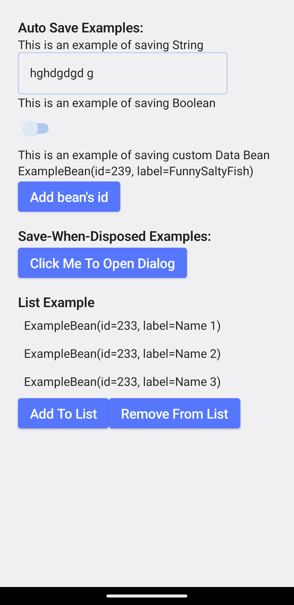

# ComposeDataSaver

| [](https://central.sonatype.com/artifact/io.github.FunnySaltyFish/data-saver-core) | [](http://www.apache.org/licenses/LICENSE-2.0) |
| ------------------------------------------------------------ | ------------------------------------------------------------ |

> The English README is translated from the Chinese version by [Transtation](https://github.com/FunnySaltyFish/Transtation-KMP). It is an powerful translation app which leverages the power of Large Language Models to do translation, developed by me as well. It is also an **Open Source Compose Multiplatform Application, and uses this library to save data**. If you're looking for a complete project, you can go there.

Elegantly accomplish data persistence in Compose Multiplatform (Android/JVM Desktop)

```kotlin
// booleanExample is initialized with false
// Local data will be automatically loaded later
var booleanExample by rememberDataSaverState("KEY_BOOLEAN_EXAMPLE", false)
// Direct assignment completes persistence
booleanExample = true

// Or in ViewModel
class MyViewModel: ViewModel() {
    // When storing an int value and the default value is 0, we suggest you marking the explicit type of the variable as `Int` to avoid being treated as `Long` by default.
    var intExample by mutableDataSaverStateOf<Int>(
        dataSaverInterface = AppConfig.dataSaver,
        key = "KEY_INT_EXAMPLE",
        initialValue = 0
    )

    fun increment() {
        intExample++ // The data will be automatically saved when the value changes
    }
}
```

- :tada: Concise: Writing style similar to native Compose functions
- :tada: Loose Coupling: Abstract interface, not limiting the underlying storage algorithm implementation
- :tada: Powerful: Supports basic data types and custom types

**Note: This library is a wrapper for using other frameworks (such as Preference, MMKV, DataStore, etc.) in Compose, not a standalone data storage framework**. You can refer to [this link](https://juejin.cn/post/7144750071156834312) to understand its design concepts.



You can click [here to download the demo for experience](demo.apk) (Debug package, may be slower compared to the release package)

---

## Introduction

Include the repository location in `settings.gradle`

```bash
dependencyResolutionManagement {
    repositories {
        mavenCentral()
    }
}
```

Include in project `build.gradle`

```bash
dependencies {
    implementation "io.github.FunnySaltyFish:data-saver-core:{version}"
}
```
> Note: Starting from v1.2.0, the repository has been migrated to Compose Multiplatform and released to Maven Central. The Group Id has also been changed. When upgrading from versions before v1.2.0, please remember to make the necessary changes.

## Sample Code
The sample codes described below can be viewed in detail [here](composeApp/src/commonMain/kotlin/com/funny/data_saver/ui/ExampleComposables.kt).

## Configuration

The project uses an implementation class of `DataSaverInterface` to save data, so **you need to provide an object of this class first.**

### Android
#### Preference
The project comes with a default implementation class `DataSaverPreferences` that uses `Preference` to save data, which can be initialized as follows:

```kotlin
// Init preferences
val dataSaverPreferences = DataSaverPreferences(applicationContext)
CompositionLocalProvider(LocalDataSaver provides dataSaverPreferences){
	ExampleComposable()
}
```

Additionally, we also provide simple implementations based on [MMKV](https://github.com/Tencent/MMKV) or [DataStorePreference](https://developer.android.google.cn/jetpack/androidx/releases/datastore).

#### MMKV

1. In addition to the above dependencies, add the following:

```bash
// If you want to use MMKV
The following:

```bash
// If you want to use MMKV
implementation "io.github.FunnySaltyFish:data-saver-mmkv:{tag}"
implementation 'com.tencent:mmkv:1.2.14'
```

2. Initialize as follows

```kotlin
// Global initialization of MMKV, for example in the onCreate of the Application
MMKV.initialize(applicationContext)
...

val dataSaverMMKV = DefaultDataSaverMMKV
// DefaultDataSaverMMKV is our default implementation provided, you can use it anywhere, just like MMKVUtils
// If you need to customize MMKV, you can choose DataSaverMMKV(MMKV.defaultMMKV())

CompositionLocalProvider(LocalDataSaver provides dataSaverMMKV){
    // ...
}
```

---

#### DataStorePreference

1. Besides the above dependencies, add the following:

```bash
// if you want to use DataStore
implementation "io.github.FunnySaltyFish:data-saver-data-store-preferences:{tag}"
def data_store_version = "1.0.0"
implementation "androidx.datastore:datastore:$data_store_version"
implementation "androidx.datastore:datastore-preferences:$data_store_version"
```

2. Initialization as follows

```kotlin
val Context.dataStore : DataStore<Preferences> by preferencesDataStore("dataStore")
val dataSaverDataStorePreferences = DataSaverDataStorePreferences(applicationContext.dataStore)

CompositionLocalProvider(LocalDataSaver provides dataSaverDataStorePreferences){
    // ...
}
```


### JVM Desktop
By default, it includes an implementation class based on `java.util.Properties` called `DataSaverProperties`, which you can initialize as follows:

```kotlin
// init properties
val dataSaver = DataSaverProperties("$userHome/$projectName/config.properties")
CompositionLocalProvider(LocalDataSaver provides dataSaver){
    ExampleComposable()
}
```

If you need encrypted storage, you can use the implementation of `DataSaverEncryptedProperties`. It encrypts each value based on the AES algorithm, and you need to provide a key.

The supported types by each of them are as follows:


|   Type    | DataSaverPreference | DataSaverMMKV | DataSaverDataStorePreferences | DataSaverProperties/DataSaverEncryptedProperties |
| :-------: | :-----------------: | :-----------: | :---------------------------: | :----------------------------------------------: |
|    Int    |          Y          |       Y       |               Y               |                        Y                         |
|  Boolean  |          Y          |       Y       |               Y               |                        Y                         |
|  String   |          Y          |       Y       |               Y               |                        Y                         |
|   Long    |          Y          |       Y       |               Y               |                        Y                         |
|   Float   |          Y          |       Y       |               Y               |                        Y                         |
|  Double   |                     |       Y       |               Y               |                        Y                         |
| Parceable |                     |       Y       |                               |                                                  |
| ByteArray |                     |       Y       |                               |                                                  |


## Save Data

After assigning the `CompositionLocalProvider`, you can use `getLocalDataSaverInterface()` inside its sub-widgets to get the current `DataSaverInterface` instance.

For basic data types (such as String/Int/Boolean), etc.:

```kotlin
// booleanExample is initialized as false
// It will automatically read local data later
var booleanExample by rememberDataSaverState("KEY_BOOLEAN_EXAMPLE", false)
// Simply assign a value to achieve persistence
booleanExample = true
```

By assigning, the data can be automatically converted and stored locally. It's as simple as that!

For other data types, you need to register type converters yourself to tell the framework how to convert your data to a string and how to restore it from a string:

```kotlin
@Serializable
data class ExampleBean(var id: Int, val label: String)
// ------------ //

// Call registerTypeConverters method to register corresponding conversion methods during initialization
// This method accepts two parameters: for converting to a serializable type for saving and deserializing to your Bean
// Here, we use Json.encodeToString and Json.decodeFromString, you can also use Gson, Fastjson, etc.
registerTypeConverters<ExampleBean>(
	save = { bean -> Json.encodeToString(bean) },
    restore = { str -> Json.decodeFromString(str) }
)

// If you only need to convert a specific state, you can pass the converter directly to the `rememberDataSaverState` function
// The priority of the converter will be higher than the global converter registered by `registerTypeConverters`
var array by rememberDataSaverState(
  "custom_type_converter_example",
  intArrayOf(1, 2, 3, 4, 5),
  // the parameter type is ITypeConverter, the ClassTypeConverter is a subclass of type accepting by type
  typeConverter = object : ClassTypeConverter(type = typeOf<IntArray>()) {
    override fun save(data: Any?): String {
      return (data as IntArray).joinToString(",")
    }

    override fun restore(str: String): Any {
      return str.split(",").map { it.toInt() }.toIntArray()
    }
  }
)
```

If you need to store nullable variables, please use `registerTypeConverters<ExampleBean?>`.

> Please note that, for implementation reasons, when dealing with nullable types, setting `state.value = null` or `dataSaverInterface.saveData(key, null)` will actually **call the corresponding `remove` method to remove the corresponding value directly**. This means that the default implementation of the framework cannot correctly save "null" values. When `state.value = null` is set and the application is reopened, **the framework will consider that the local value corresponding to this `key` does not exist, and will set the value to `initialValue`**.
> If you really need to store "null" and `initialValue != null`, please handle this part of the logic manually. For example, set a special value to represent "null", such as `ExampleBean(-1, "null")`; if you have a better solution, feel free to submit a pull request!

Since v1.2.1, besides using type information to register converters, you can also write additional conditional statements:

```kotlin
inline fun <reified T> registerTypeConverters(
      noinline save: (T) -> String,
      noinline restore: (String) -> T,
      noinline acceptCondition: (T) -> Boolean
)
```

The framework will call the corresponding `save` and `restore` methods to convert the corresponding data when `acceptCondition` is `true`.

> **Note:**

> 1. Please call `registerTypeConverters` during initialization to ensure it is called before using `rememberDataSaverState("key", ExampleBean())`.
> 2. Multiple type converters will be tried in the order of registration until a suitable converter is found. Therefore, if you register multiple converters of the same type, the framework will use the first registered converter.
> 3. You can access the list of all registered converters through `DataSaverConverters.typeConverters`. Some default converters are initially provided, such as support for `String`

## Using Outside of Composable Functions

In some cases, you may need to place `DataSaverState` outside of a `@Composable` function, such as in a `ViewModel`. Starting from v1.1.0, the `mutableDataSavarStateOf` function is provided for this purpose, which will automatically read and convert the saved values, returning a State.

```Kotlin
object AppConfig {
    val dataSaver = DataSaverMMKV(...)
}

class MyViewModel: ViewModel() {
    var username: String by mutableDataSavarStateOf(AppConfig.dataSaver, "username", "")
}
```

## Using Other Storage Frameworks

If the default provided implementations do not meet your needs, you can inherit from the `DataSaverInterface` yourself and override the `saveData` and `readData` methods respectively for saving data and reading data. For some coroutine-enabled frameworks (such as `DataStore`), you can also override `saveDataAsync` to achieve asynchronous saving.

```kotlin
abstract class DataSaverInterface(val senseExternalDataChange: Boolean = false) {
    abstract fun <T> saveData(key: String, data: T)
    abstract fun <T> readData(key: String, default: T): T
    open suspend fun <T> saveDataAsync(key: String, data: T) = saveData(key, data)
    abstract fun remove(key: String)
    abstract fun contains(key: String): Boolean

    var externalDataChangedFlow: MutableSharedFlow<Pair<String, Any?>>? =
        if (senseExternalDataChange) MutableSharedFlow(replay = 1) else null
}
```

Then change the object provided by `LocalDataSaver` to an instance of your own class.

```kotlin
val dataSaverXXX = DataSaverXXX()
CompositionLocalProvider(LocalDataSaver provides dataSaverXXX){
    ExampleComposable()
}
```

You can continue using it in the same way.

## Perceive External Data Changes
Since v1.1.6, the framework has added **limited support for perceiving external data changes**. Specifically, when you modify the value corresponding to a key externally, the framework will automatically perceive it and update the corresponding `MutableDataSaverState`, triggering the update of the Composable.

Currently, only `rememberDataSaverState` supports this functionality, and you need to set the `senseExternalDataChange` parameter to `true`. Additionally, the corresponding `DataSaverInterface` also needs to set `senseExternalDataChange` to true.

```kotlin
val dataSaverXXX = DataSaverXXX(senseExternalDataChange = true)
CompositionLocalProvider(LocalDataSaver provides dataSaverXXX){
    val stringExample by rememberDataSaverState(
        key = key,
        initialValue = "Hello World(1)",
        senseExternalDataChange = true
    )
        ...
    onClick = {
        // The value corresponding to the key is modified externally, and the Composable will automatically update at this point
        dataSaverXXX.saveData(key, "Hello World(2)")
    }
}
```
Regarding MMKV itself, it does not support perceiving data changes, so its data changes are manually submitted by `DataSaverMMKV`.If you need to perceive data changes when using MMKV, you need to call `DataSaverMMKV::saveData` to save the data; the desktop-based Properties implementation does not support perceiving external data changes.

Please note that when the new data is null, the following situations may occur:
- When using `rememberDataSaverState`
  - If T is a nullable type, such as `ExampleBean?`, then it should be set to null.
  - If T is a non-nullable type, such as `ExampleBean`, then the value of State will be reset to the `initialValue`.

## Advanced Settings

### Controlling the Save Policy

In v1.1.0, the original `autoSave` has been upgraded to `savePolicy` to control whether and when data persistence is done. The default value is `IMMEDIATELY`.

This class currently includes the following three values:

```Kotlin
open class SavePolicy {
    /**
     * Default mode, performs data persistence each time a new value is assigned to the state's value.
     */
    object IMMEDIATELY : SavePolicy()

    /**
     * Performs data persistence on Composable `onDispose`, suitable for cases where data changes frequently and this Composable will enter onDispose.
     * **Use with caution, as onDispose may not be called in some situations.**
     */
    object DISPOSED: SavePolicy()

    /**
     * Will not perform automatic persistence operations, please call `state.saveData()` as needed.
     * Example: `onClick = { state.saveData() }`
     */
    object NEVER : SavePolicy()
}
```

### Setting Library Parameters

Currently, the library provides some parameters that can be set under `DataSaverConfig`.

```kotlin
/**
 * 1. DEBUG: Whether to output debug information of the library
 */
object DataSaverConfig {
    var DEBUG = true
}
```

### Asynchronous Saving

In version 1.1.0, `suspend fun saveDataAsync` was added to `DataSaverInterface` for asynchronous saving. By default, it is equivalent to `saveData`. For frameworks that support coroutines (such as `DataStore`), using this implementation helps to fully leverage the advantages of coroutines (the default `DataStorePreference` does this).

At the function call of `mutableDataSavarStateOf`, you can set `async` to enable asynchronous saving, which defaults to `true`.

### @Preview Support
Starting from version 1.1.6, the project supports @Preview. Specifically, as `CompositionLocalProvider` cannot be used normally in @Preview mode, `DataSaverInMemory` was additionally implemented. It uses a `HashMap` to store data, eliminating the reliance on local storage and `CompositionLocalProvider`.

```kotlin
@Composable
@ReadOnlyComposable
fun getLocalDataSaverInterface() =
    if (LocalInspectionMode.current) DefaultDataSaverInMemory else LocalDataSaver.current
```

When using the @Preview mode, you may need to re-register the type converter by calling `registerTypeConverter` again.

## Projects in use

Currently, this library has been used in the following projects:

- [Transtation: AI translation software based on KMP + CMP | Total Stars 380+](https://github.com/FunnySaltyFish/Transtation-KMP)
- [tts-server-android | Star 3k+ ](https://github.com/jing332/tts-server-android)
- [Search on Github](https://github.com/search?q=mutableDataSaverStateOf&type=code)

If you are using this project, feel free to let me know to include it here.

For any suggestions or bug reports, please submit an issue. Pull requests are even better.


--------------------
This result is generated by Transtation App\'s Long Text Translation function with GPT-3.5-Turbo by one-click
